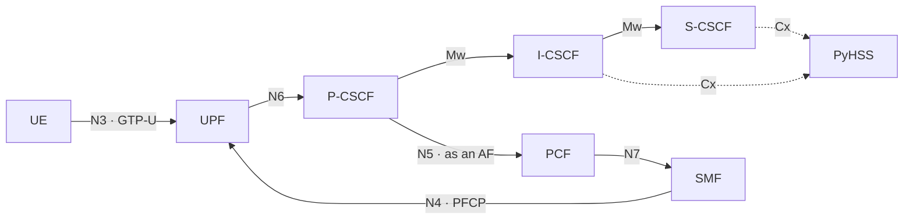

# kamailio-free5gc

An IMS running on top of a 5G core, wired together the way 3GPP specifies and
verified one interface at a time.

A 5G core authenticates a device, gives it an address, and forwards its
packets. It does not give it phone calls — that is IMS, a separate system that
speaks SIP and decides who is ringing whom. This repository runs both in
containers, connects them, and proves each connection rather than assuming it.



## What it does

- **Runs the three CSCF roles separately.** P-CSCF, I-CSCF and S-CSCF are
  distinct Kamailio instances, so the interfaces between them are real.
- **Authenticates with IMS AKA.** Registration is challenged against vectors
  fetched from an HSS over Cx — all four Cx exchanges (UAR, MAR, SAR, LIR) are
  used.
- **Gives IMS its own PDU session.** A dedicated `ims` DNN, so SIP and media do
  not share a tunnel with general traffic.
- **Discovers the P-CSCF from the network.** The UE asks for it in the PDU
  Session Establishment Request and the SMF answers in the PCO; nothing is
  hardcoded in the device.
- **Reserves QoS for calls.** The P-CSCF acts as an Application Function over
  N5, and the resulting rule is verified in the kernel, where `gtp5g` matches
  packets against it.

## Requirements

| | |
|---|---|
| OS | Linux, with a kernel you can build out-of-tree modules for |
| Docker | Engine with the Compose v2 plugin |
| Kernel headers | `linux-headers-$(uname -r)` |
| gtp5g | A checkout of [free5gc/gtp5g](https://github.com/free5gc/gtp5g) — `~/gtp5g` by default, or set `GTP5G_DIR` |
| Go | Optional, used by the tests to read the user plane's rules |
| sudo | Passwordless, for loading the module and capturing packets |

`gtp5g` is a kernel module and is deliberately not vendored here: it has to be
rebuilt after every kernel upgrade, so it belongs outside the repository.

## Quick start

```bash
git clone https://github.com/DBGR18/kamailio-free5gc.git
cd kamailio-free5gc
mkdir -p cert                  # bind-mounted by the network functions; starts empty

./scripts/00-setup-gtp5g.sh    # build and load the user-plane kernel module
./scripts/01-up.sh             # everything else
```

`01-up.sh` builds the local images, starts the 5G core and the IMS, provisions
two subscribers into both databases, then brings up the gNB and the UEs. It
returns when both UEs hold a PDU session:

```
[up] waiting for the UEs to get a PDU session...
[up]   ue1: 10.62.0.1
[up]   ue2: 10.62.0.2

[up] ready. Both UEs have a PDU session and can reach the IMS.
```

Tear it down with:

```bash
./scripts/99-down.sh
```

The kernel module stays loaded; the containers, networks and volumes do not.

## Verifying it works

```bash
./scripts/03-call-test.sh      # registration, call, media, and QoS end to end
./scripts/05-n5-qos-test.sh    # the policy chain on its own, without SIP
```

`03-call-test.sh` registers both subscribers, places a call from one to the
other, exchanges G.711, and hangs up. It then checks four separate things:
that the INVITE really traversed three CSCF roles, that all four Cx exchanges
were used, that the P-CSCF reserved QoS as an Application Function, and that
everything travelled inside GTP-U rather than over the container network
underneath. Both scripts exit non-zero when they fail.

`05-n5-qos-test.sh` drives the Application Function directly, with no SIP
involved. It exists so that a failure can be placed: if it passes and the
end-to-end test does not, the problem is in the IMS rather than the core.

## Scripts

| Script | What it does |
|---|---|
| `00-setup-gtp5g.sh` | Build and load the user-plane kernel module. Once per kernel. |
| `01-up.sh` | Bring up everything and provision subscribers |
| `02-add-subscribers.sh` | 5G subscription data into the UDR. Called by `01-up.sh`. |
| `03-call-test.sh` | The end-to-end test |
| `04-add-ims-subscribers.sh` | IMS identities into the HSS. Called by `01-up.sh`. |
| `05-n5-qos-test.sh` | The policy chain on its own |
| `99-down.sh` | Tear everything down |

The provisioning scripts are safe to re-run.

## Layout

| Path | Contents |
|---|---|
| `docker-compose.yaml` | The whole topology: two networks, and the UPF bridging them |
| `config/` | free5gc network function and UE configuration |
| `pcscf/`, `icscf/`, `scscf/` | The three CSCF roles, one Kamailio each |
| `hss/` | PyHSS configuration |
| `af/` | The shim that lets the P-CSCF speak to the PCF |
| `ran/` | gNB, UE, and the SIP scenarios they run |
| `scripts/` | Bring-up, provisioning, tests, teardown |
| `docs/` | Architecture and concepts |

## Configuration

Two subscribers are provisioned, sharing one PLMN:

| | |
|---|---|
| PLMN | MCC 208, MNC 93 |
| IMS domain | `ims.mnc093.mcc208.3gppnetwork.org` |
| Subscribers | IMSI `208930000000001` and `208930000000002` |
| Public identities | `sip:<IMSI>@ims.mnc093.mcc208.3gppnetwork.org` |
| DNNs | `internet` (10.60/16, 10.61/16) and `ims` (10.62/16) |

Key material comes from 3GPP's published test values and lives in
`scripts/lib-keys.sh`, which is the single place it is defined — the other
copies are derived from it.

Two web interfaces are published on the loopback address only:

| | |
|---|---|
| free5gc WebConsole | http://127.0.0.1:5000 |
| PyHSS API | http://127.0.0.1:8080 |

## Documentation

`docs/` covers the design rather than the commands:

| | |
|---|---|
| [architecture.md](docs/architecture.md) | Components, networks, and the interfaces between them |
| [identities.md](docs/identities.md) | How one subscriber becomes a 5G identity and an IMS identity |
| [call-flows.md](docs/call-flows.md) | Attach, registration and call setup, message by message |
| [policy-and-qos.md](docs/policy-and-qos.md) | How a SIP call becomes a QoS rule in the user plane |
| [testing.md](docs/testing.md) | What each test asserts, and what it deliberately does not |

## Versions

| Component | Version |
|---|---|
| free5gc | v4.2.3 |
| gtp5g | master |
| Kamailio | 6.x, from the Debian package |
| PyHSS | latest |
| free-ran-ue | v2.5.0, patched for P-CSCF discovery |

## Built on

[free5gc](https://github.com/free5gc/free5gc) ·
[Kamailio](https://github.com/kamailio/kamailio) ·
[PyHSS](https://github.com/nickvsnetworking/pyhss) ·
[free-ran-ue](https://github.com/free-ran-ue/free-ran-ue)
