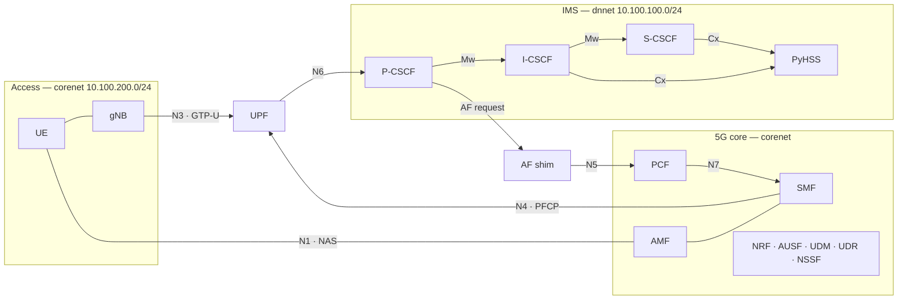

# Architecture

## The two halves

A 5G core and an IMS solve different problems, and they are usually built and
operated separately.

**The 5G core** authenticates a device, admits it to the network, gives it an
IP address, and forwards its packets. It has no idea what those packets mean.
A PDU session is a tunnel with an address on the end of it.

**The IMS** is what makes a phone call a phone call. It knows that
`sip:alice@example.org` is currently reachable at a particular address, that
she is allowed to place calls, and that the media stream she is about to open
needs different treatment from a software update.

To the 5G core, the IMS is an ordinary server on an external data network. To
the IMS, the 5G core is an access network that delivers packets and can be
asked for favours. Three things connect them:

| Connection | Direction | Purpose |
|---|---|---|
| **N6** | user plane | SIP and RTP travel over the PDU session like any other traffic |
| **PCO** | during PDU session setup | the network tells the device where its P-CSCF is |
| **N5** | IMS to core | the P-CSCF, acting as an Application Function, asks for QoS |

Everything else in this document is detail underneath those three.

## Topology

Two networks, deliberately separate:

The separation is the point. A UE cannot reach the IMS except by going through
the UPF, because the two networks share no other path. There is no NAT on N6
either, so the CSCFs see real UE addresses — which matters, because those
addresses are what the policy plane binds a QoS rule to.

Two containers sit on both networks, for different reasons:

- The **UPF** bridges the user plane. That is its job: N3 on one side, N6 on
  the other.
- The **AF** is dual-homed because an Application Function faces the service
  it represents on one side and the core's service-based interface on the
  other. It is inside the operator's trust domain, not outside it.

### Addresses

| Component | corenet | dnnet | Listens on |
|---|---|---|---|
| AMF | 10.100.200.16 | — | NGAP/SCTP 38412 |
| gNB | 10.100.200.40 | — | — |
| UPF | 10.100.200.30 | 10.100.100.30 | GTP-U 2152, PFCP 8805 |
| AF shim | 10.100.200.50 | 10.100.100.40 | HTTP 8090 |
| P-CSCF | — | 10.100.100.10 | SIP/UDP 5060 |
| S-CSCF | — | 10.100.100.21 | SIP/UDP 6060 |
| I-CSCF | — | 10.100.100.22 | SIP/UDP 4060 |
| PyHSS | — | 10.100.100.20 | Diameter 3868 |

Other 5G network functions use their service names on `corenet` and are
reached over the SBI; they do not need fixed addresses.

## The 5G side

Standard free5gc, unmodified. The parts that matter here:

- **AMF** terminates NAS and NGAP. Registration and PDU session requests
  arrive here.
- **SMF** owns the PDU session. It selects the UPF, programs it over PFCP, and
  fills in the PCO the UE gets back.
- **UPF** forwards packets. It runs on `gtp5g`, an out-of-tree kernel module,
  so the rules it enforces live in the kernel and can be read from there.
- **PCF** makes policy decisions and turns an Application Function's request
  into PCC rules for the SMF.
- **UDM / UDR / AUSF** hold and check 5G subscription data and run 5G-AKA.

### Data networks

Two DNNs, because IMS traffic should not share a PDU session with everything
else. A UE that attaches to both gets two tunnels and two addresses.

| DNN | UE pool | Purpose |
|---|---|---|
| `internet` | 10.60.0.0/16, 10.61.0.0/16 | General traffic |
| `ims` | 10.62.0.0/16 | SIP signalling and RTP media |

The `ims` DNN also carries a P-CSCF address in its configuration. That is what
the SMF hands back during PDU session establishment; see
[call-flows.md](call-flows.md).

Both UEs draw from the same `ims` pool, so media between them is forwarded by
the UPF from one PDU session straight into the other. The packets go up the
tunnel and back down without leaving the user plane.

## The IMS side

Three Kamailio instances, one per CSCF role. They are separate processes with
separate configurations because the roles are genuinely different, and because
splitting them is what forces each interface between them to exist.

### P-CSCF — the access proxy

The only IMS node a UE ever talks to. It is deliberately the least clever of
the three: it holds no subscriber data and never queries the HSS.

- Adds a `Path` header to REGISTER, so that later requests for that UE come
  back through it.
- Adds `P-Visited-Network-ID`, which the I-CSCF needs for the HSS query.
- Records the binding once registration succeeds.
- Acts as the **Application Function** for calls it proxies — see
  [policy-and-qos.md](policy-and-qos.md).

It sees each call twice: once on the way out from the caller, once on the way
in to the callee, because both UEs are behind the same access proxy.

### I-CSCF — the entry point

Answers exactly one question: *which S-CSCF serves this user?* It answers it
by asking the HSS, and keeps no state of its own.

- **UAR/UAA** on REGISTER — assign or look up the serving S-CSCF.
- **LIR/LIA** on an incoming call — find where the callee is registered.

### S-CSCF — the serving node

Where registration stops being a matter of trust.

- **MAR/MAA** — fetch authentication vectors from the HSS.
- Challenges the UE with IMS AKA and verifies the response.
- **SAR/SAA** — register itself as the serving S-CSCF and receive the user
  profile.
- Resolves a called public identity to the contact the UE registered, and
  routes the call there via the stored `Path`.

### PyHSS — the IMS subscriber database

Holds IMS identities and the key material used for IMS AKA. It speaks Cx over
Diameter to the I-CSCF and the S-CSCF.

## Why the HSS and the UDR do not talk

This is the question the split raises, and the answer is that they should not.

The UDR holds 5G subscription data: SUPI, the 5G-AKA key material, slice and
DNN subscriptions. The HSS holds IMS data: IMPI, IMPU, MSISDN, service
profiles, and the key material for IMS AKA. The two authentications are
separate procedures with separate sequence numbers, and neither ever reads the
other's records.

So there is no interface between them, and 3GPP does not define one for this
case. What exists instead is a provisioning-time relationship: the same
subscriber is entered into both, and the identities are derived from the same
IMSI so they stay consistent. See [identities.md](identities.md).

## Reference points

| Name | Between | Protocol |
|---|---|---|
| N1 / N2 | UE, gNB, AMF | NAS over NGAP/SCTP |
| N3 | gNB, UPF | GTP-U |
| N4 | SMF, UPF | PFCP |
| N5 | AF, PCF | HTTP/2, `Npcf_PolicyAuthorization` |
| N6 | UPF, data network | IP |
| N7 | SMF, PCF | HTTP/2, `Npcf_SMPolicyControl` |
| Gm | UE, P-CSCF | SIP |
| Mw | CSCF to CSCF | SIP |
| Cx | I/S-CSCF, HSS | Diameter, application 16777216 |

## Radio and terminal

`free-ran-ue` provides both the gNB and the UE. It does GTP-U in user space
over a TUN device, so nothing on the access side needs the kernel module —
only the UPF does.

It is patched here to take part in P-CSCF discovery: upstream asks the network
for DNS servers but not for a P-CSCF, and discards the network's half of the
PCO unread. The patch adds the request and keeps the answer, and is applied
when the image is built.

SIP is generated by SIPp running *inside* the UE container, bound to the
tunnel interface. That is what makes the traffic take the 5G user plane rather
than the container network underneath it.
