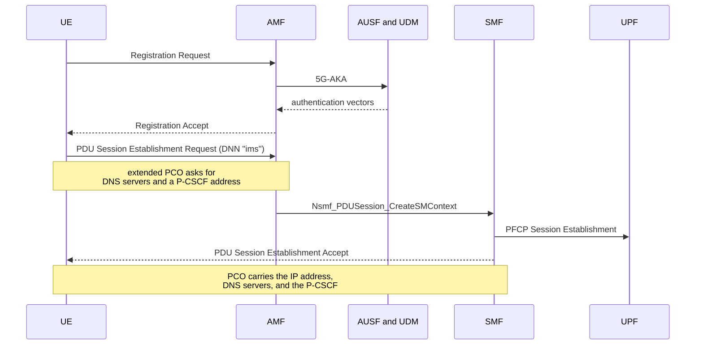
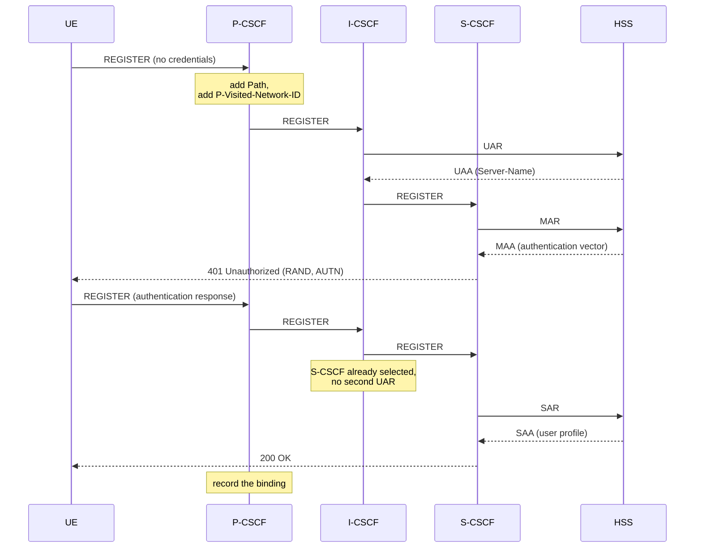
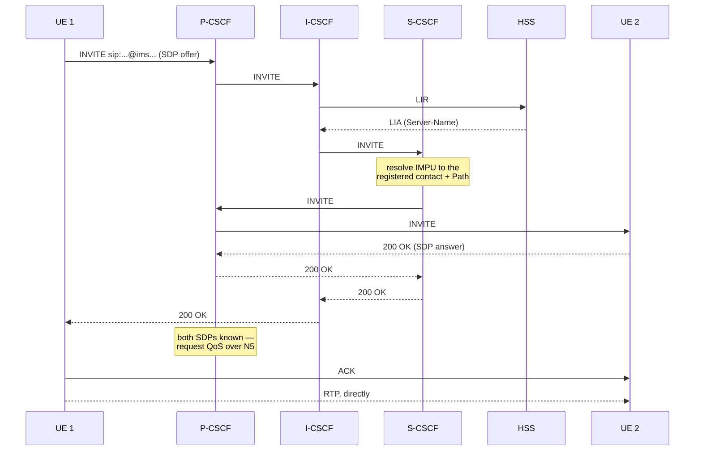

# Call flows

Three procedures, in the order a device performs them: attaching to the
network, registering with the IMS, and placing a call.

## 1. Attach and PDU session establishment

Standard 5G, with one addition that matters for IMS.



### P-CSCF discovery

A UE has to find its P-CSCF before it can do anything else, and hardcoding the
address defeats the purpose of having an access proxy at all. The network
tells it instead.

The UE sets the *P-CSCF IPv4 Address Request* container in the extended
Protocol Configuration Options of its establishment request. The SMF answers
from the DNN's own configuration — the `ims` DNN carries a P-CSCF address for
exactly this — and returns it in the PCO of the accept, in container `000Ch`
(TS 24.008).

This is the same mechanism the UE already uses to learn its DNS servers. If
the DNN has no P-CSCF configured, the container simply comes back absent, and
that is not an error.

## 2. IMS registration

Two round trips, because the first REGISTER carries no credentials and exists
only to be challenged.



Four Cx exchanges are involved and each has a distinct job:

| Command | Asked by | Question |
|---|---|---|
| UAR / UAA | I-CSCF | Which S-CSCF should serve this user? |
| MAR / MAA | S-CSCF | Give me an authentication vector for this IMPI. |
| SAR / SAA | S-CSCF | I am now serving this user; give me the profile. |
| LIR / LIA | I-CSCF | Where is this user registered? (calls only) |

Two details do real work:

**`Path`.** The P-CSCF inserts it into the REGISTER. The S-CSCF stores it with
the binding, and uses it later to route an incoming call back through the same
access proxy rather than straight at the UE. Without it the P-CSCF would be
bypassed on the terminating leg and could neither see the SDP nor request QoS.

**`P-Visited-Network-ID`.** The I-CSCF copies it into the UAR's
Visited-Network-Identifier, which is how the HSS applies roaming policy. It
has no default; the P-CSCF has to supply it.

## 3. Call setup

The call leaves the caller, is routed by the network to the callee's serving
S-CSCF, and comes back down through the access proxy the callee registered
through.



The P-CSCF appears twice on purpose. It is the access proxy for both
subscribers, so it handles the originating leg and, after the `Path` brings
the request back, the terminating leg. It tells the two apart by which side
the request arrived from.

### Media does not pass through the IMS

SIP negotiates; it does not carry media. The SDP offer and answer tell each
side where to send RTP, and the stream then flows end to end without touching
a CSCF.

Here both UEs are on the same DNN, so the media path is:

```
UE 1  ──GTP-U──▶  UPF  ──▶  UPF  ──GTP-U──▶  UE 2
```

The uplink packet is decapsulated, matched against the route for the UE pool,
and sent straight back down the other subscriber's tunnel. It crosses the user
plane twice and never leaves it.

A production IMS usually anchors media anyway, at an IMS-AGW beside the
P-CSCF, for NAT traversal, topology hiding, lawful interception and
transcoding. None of those apply here, and — importantly — none of them are
needed for the policy work: the Application Function only has to *read* the
SDP, not carry the packets. See [policy-and-qos.md](policy-and-qos.md).
