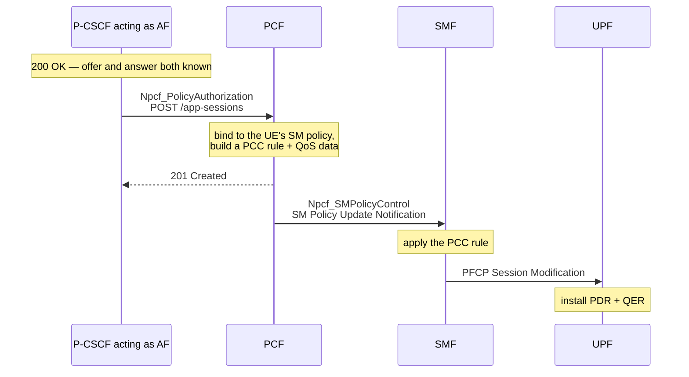

# Policy and QoS

A voice call needs different treatment from a file download, and the network
has no way to tell them apart by looking at the packets. Something has to say
so. In IMS that something is the P-CSCF, because it is the node that sees the
negotiated SDP and therefore knows which five-tuple is about to carry speech.

## The Application Function

An Application Function is any service inside the operator's trust domain that
is allowed to ask the policy function for treatment on behalf of a session.
The P-CSCF is the canonical one: when a call is answered, it tells the PCF
"this UDP flow between these two addresses and ports is conversational voice",
and the PCF turns that into policy the user plane can enforce.

Note what the AF does *not* do. It does not carry the media, and it does not
need to. It reads the addresses out of the SDP and reports them. Media
anchoring is a separate concern with separate motivations.

## The chain



Each hop translates the request into the next layer's vocabulary:

| Layer | Object |
|---|---|
| SDP | `c=` address and `m=audio` port, two of them |
| N5 | media component, media type `AUDIO`, flow descriptions, bit rates |
| PCF | PCC rule + QoS data, 5QI derived from the media type |
| N7 | SM policy decision, sent to the SMF as a notification |
| PFCP | Packet Detection Rule with an SDF filter, plus a QoS Enforcement Rule |
| Kernel | a rule `gtp5g` matches packets against |

### Flow descriptions

The AF describes the media as IP filter rules written from the network's point
of view, with direction carried by the verb rather than by the addresses:

```
permit out 17 from <peer> <port> to <ue> <port>    downlink
permit in  17 from <peer> <port> to <ue> <port>    uplink
```

The PCF rewrites the uplink form and passes both on as flow information inside
the PCC rule.

### Media type and 5QI

The media type selects the 5QI. `AUDIO` maps to 5QI 1 — conversational voice,
a GBR class — and that is the only branch in which the requested bit rates are
read at all. Any other media type lands on a non-GBR 5QI and the bandwidth
fields are ignored.

## One call, two reservations

Both subscribers here are served by the same P-CSCF, and each has its own PDU
session. A PDU session is where QoS is enforced, so each one needs its own
flow:

- the originating leg reserves on the caller's session,
- the terminating leg reserves on the callee's session.

The flow descriptions are mirror images of each other, because "uplink" means
something different on each side. Both reservations are released when the call
ends.

## Verification

The claim worth making is that the rule reached the user plane, so that is
what gets checked — in the kernel, by reading the rules `gtp5g` is matching
packets against. A call installs, per subscriber:

- a PDR for the uplink and a PDR for the downlink, each with an SDF filter
  matching the RTP five-tuple, at a precedence ahead of the session's default
  rule,
- a QER carrying the requested guaranteed and maximum bit rates.

Releasing the session removes them again.

**Throughput is deliberately not measured.** free5gc implements the QoS
structures — 5QI, GBR and MBR fields, QoS flow descriptions — but nothing
underneath acts on them. There is no rate limiting and no guaranteed bit rate.
A throughput measurement would therefore say nothing about whether the policy
chain worked, and reporting one as evidence would be misleading. "The rule was
installed" is the strongest true claim available.

## Design notes

### Why there is an AF shim

Kamailio's `ims_qos` module speaks Rx, the Diameter-based interface from 4G.
free5gc has no Rx at all; its PCF offers the 5G equivalent,
`Npcf_PolicyAuthorization`, over HTTP/2 without TLS. Kamailio's HTTP client is
built on libcurl and does not speak HTTP/2 with prior knowledge, so nothing in
Kamailio can reach the PCF directly.

A small service bridges exactly that gap: plain HTTP on the side Kamailio
calls, HTTP/2 on the side that calls the PCF. It holds no policy logic of its
own — it translates a call's SDP into an application session and back.

It registers with the NRF as an AF and obtains an access token like any other
network function, because an Application Function is a service consumer inside
the trust domain, not an external client.

### Session binding

The PCF has to find the PDU session a request belongs to. It does that by UE
IP address, and the AF supplies the SUPI as well so the lookup is direct
rather than a search.

The address the AF reports is the one the P-CSCF observed, not the one in the
SDP. They are the same here, but they are not the same kind of claim: the PDU
session address is what the network assigned, while the SDP is what the device
said about itself. Policy binds to the former.

### A note on OAuth

This deployment runs with the NRF's OAuth support disabled, and that is a
downgrade rather than a preference.

With it enabled, the PCF cannot deliver a policy update to the SMF. The PCF
requests a token scoped to the service it is invoking, `nsmf-callback`, which
is correct — but the SMF applies a second authorization check on that route
naming `npcf-smpolicycontrol`, a service the SMF does not provide. The NRF only
grants a scope for a service the target function advertises, so the token the
SMF demands cannot be issued at all. Both values are compiled in.

The AF still requests and presents a token whenever the NRF issues one, and
drops the header only when told OAuth is off, so re-enabling it needs no code
change once the mismatch is resolved upstream.
